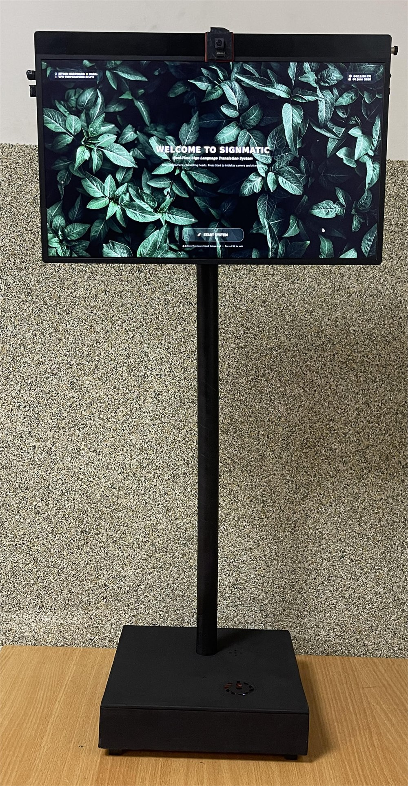
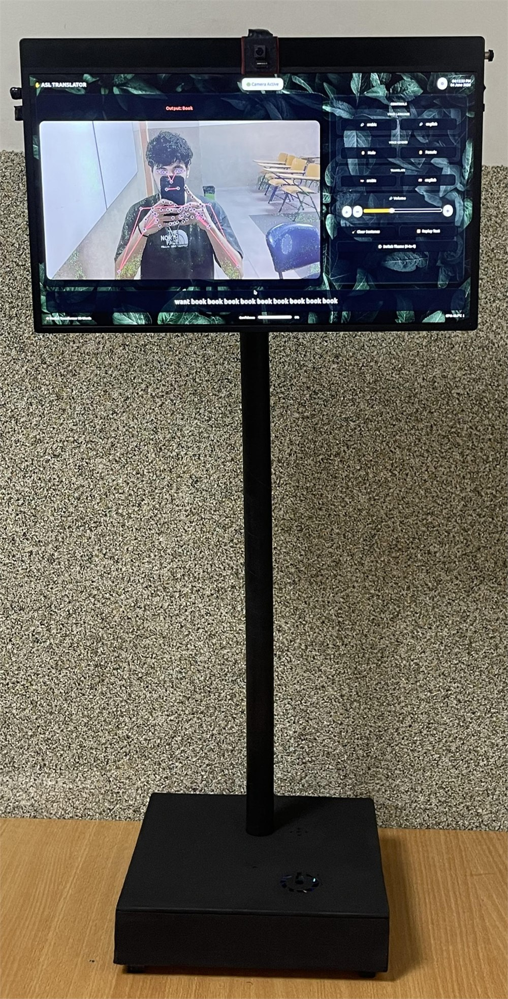
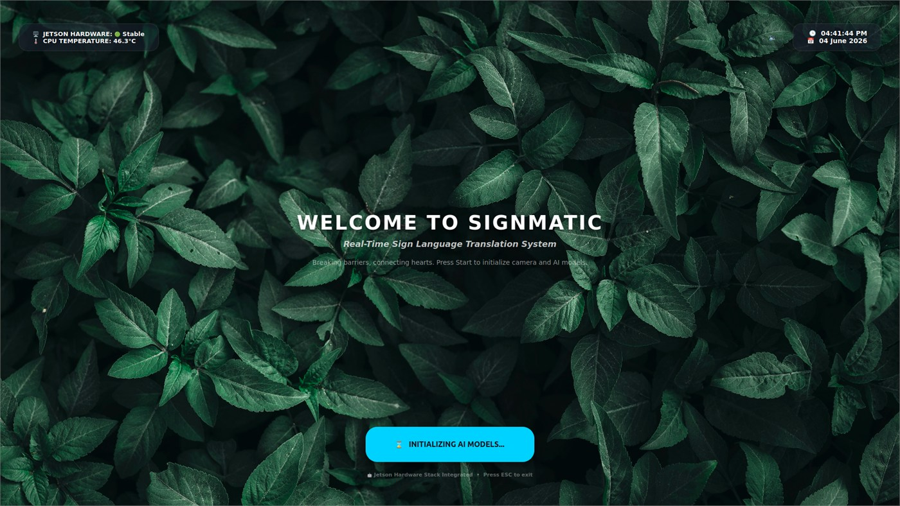
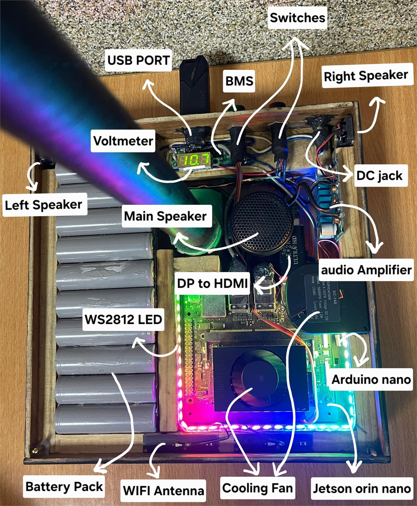

# SignMatic: Real-Time Skeleton-Based ASL Recognition

SignMatic is a real-time American Sign Language (ASL) recognition and translation system. It extracts pose and hand landmarks with MediaPipe, classifies 30-frame landmark sequences with a Transformer encoder, and displays recognized words as text with speech output. The final system supports 50 ASL words plus an Idle class and was deployed on a Jetson Orin Nano-based touchscreen station.

## Project Preview

### Embedded Prototype

| Startup screen | Live recognition |
| --- | --- |
|  |  |

### Touchscreen Interface



### Hardware Integration



## Main Features

- Real-time skeleton-based ASL word recognition from webcam or camera-module input.
- MediaPipe Holistic landmark extraction using pose, left hand, and right hand keypoints.
- 30-frame temporal input sequence with 258 numerical features per frame.
- Transformer encoder model with two encoder blocks, multi-head self-attention, residual connections, layer normalization, dense classification layers, and a 51-class softmax output.
- Hybrid training data built from custom recorded keypoint sequences, MS-ASL clips, and synthetic augmentation applied to the custom keypoint sequences.
- Real-time acceptance logic using confidence thresholding, stable repeated predictions, recent hand-presence checks, cooldown timing, and an Idle class.
- ONNX export for embedded deployment and TensorRT execution on Jetson Orin Nano.
- Jetson touchscreen interface with English and Arabic text output, selectable voice profiles, replay, clear sentence, volume control, theme switching, and offline speech synthesis.

## Repository Structure

```text
src/
  custom/      Custom data collection, custom-only training, and custom augmentation.
  msasl/       MS-ASL metadata filtering, video download, clip cutting, and keypoint extraction.
  hybrid/      Final hybrid dataset building, Transformer training, evaluation, ONNX export, and laptop inference.
jetson/        Jetson deployment scripts for the welcome screen and real-time kiosk interface.
data/          Local datasets and processed arrays. Ignored by Git.
models/        Local trained models and exported ONNX/TensorRT engines. Ignored by Git.
outputs/       Local logs, plots, and experiment outputs. Ignored by Git.
```

The repository tracks source code and deployment scripts. Large generated files such as datasets, videos, NumPy arrays, trained models, TensorRT engines, Piper voice models, and logs are intentionally not committed.

## Dataset

The final dataset release is available on Kaggle:

https://www.kaggle.com/datasets/joesarkis/signmatic-asl-keypoint-dataset-50-words-and-idle

The dataset is keypoint-based, not raw-video-based. Each sample is represented as a 30-frame sequence. Each frame contains:

- 33 pose landmarks with `x`, `y`, `z`, and visibility values.
- 21 left-hand landmarks with `x`, `y`, and `z` values.
- 21 right-hand landmarks with `x`, `y`, and `z` values.
- 258 features per frame in total.

Synthetic augmentation is applied only to the custom keypoint sequences. MS-ASL samples are used as extracted keypoint sequences without synthetic augmentation.

## Vocabulary

The final classifier contains 51 classes:

- 50 ASL words: `Nice`, `Eat`, `Yes`, `No`, `Water`, `Help`, `Hello`, `Fine`, `Good`, `Please`, `Give`, `We`, `A`, `Have`, `Work`, `So`, `Hard`, `Live`, `Love`, `Thanks`, `High`, `Grade`, `Lebanese`, `International`, `University`, `Teacher`, `Happy`, `Like`, `Want`, `Deaf`, `School`, `What`, `Need`, `Friend`, `Learn`, `Book`, `Computer`, `Again`, `Father`, `Mother`, `Where`, `Forget`, `Nothing`, `I`, `You`, `And`, `My`, `Name`, `Is`, `ILoveYou`.
- `Idle`, used when no supported sign is being accepted.

## Model Architecture

The final model is implemented in `src/hybrid/train_transformer_model.py`.

```text
Input: 30 frames x 258 features
Dense projection: 258 -> 128
Transformer encoder block 1:
  Multi-head self-attention: 4 heads, key dimension 64
  Residual connection + layer normalization
  Feed-forward network: 128 -> 256 -> 128
  Residual connection + layer normalization
Transformer encoder block 2:
  Same structure as block 1
Global average pooling over the time dimension
Dense 128 + ReLU + dropout
Dense 64 + ReLU + dropout
Dense 51 + softmax
```

Final thesis evaluation reported about 98% test accuracy on the hybrid 50-word-plus-Idle dataset. In real time, the model output is filtered by the inference layer before a word is accepted.

## Laptop Setup

Create a virtual environment and install the Python dependencies:

```powershell
python -m venv .venv
.\.venv\Scripts\activate
pip install -r requirements.txt
```

## Training Workflow

The normal final training workflow is:

```powershell
python src/custom/augment_custom_keypoints.py
python src/hybrid/build_hybrid_dataset.py
python src/hybrid/train_transformer_model.py
```

The training script expects the processed arrays under:

```text
data/Hybrid/processed_hybrid_50_augmented_v2/
```

It writes the trained Keras model under:

```text
models/final_signmatic_transformer_50words.h5
```

## Evaluation and Conversion

Evaluate the saved Transformer model on the hybrid test split:

```powershell
python src/hybrid/evaluate_hybrid_confusion.py
```

Export the Keras model to ONNX:

```powershell
python src/hybrid/convert_model_to_onnx.py
```

Check the ONNX model:

```powershell
python src/hybrid/test_onnx_model.py
```

## Laptop Real-Time Inference

After placing the trained Keras model at `models/final_signmatic_transformer_50words.h5`, run:

```powershell
python src/hybrid/realtime_hybrid_inference.py
```

The laptop inference script opens the webcam, extracts MediaPipe landmarks, keeps a 30-frame sequence buffer, predicts a class, and accepts the word only when the confidence, stability, hand-presence, and cooldown checks are satisfied.

## Jetson Deployment

The Jetson deployment files are in `jetson/`.

- `welcome_app.py` displays the startup interface and launches the main translator.
- `signmatic_kiosk.py` runs the PyQt5 touchscreen interface, camera pipeline, TensorRT inference, English/Arabic output logic, and offline Piper speech synthesis.
- `requirements-jetson.txt` lists Python packages used by the Jetson application. TensorRT, CUDA, and PyCUDA should match the JetPack installation on the device.

Expected local Jetson folders:

```text
models/
  final_signmatic_transformer_50words.trt
jetson/
  assets/
    welcome_background.jpg
    theme_1.jpg
    theme_2.jpg
    theme_5.jpg
  voices/
    ryan.onnx
    hfc_female.onnx
    kareem.onnx
```

Voice and model binaries are not committed to Git because they are generated or downloaded assets.

## GitHub Notes

Keep these files and folders out of commits:

- `.venv/`
- `data/`
- `models/`
- `outputs/`
- `Logs/`
- `*.npy`, `*.npz`
- `*.h5`, `*.keras`, `*.onnx`, `*.trt`, `*.engine`, `*.tflite`
- Piper voice model files
- raw videos and temporary experiment outputs

If large assets need to be shared, use Kaggle, GitHub Releases, or Git LFS instead of committing them directly to the repository.

## Authors

Joe Sarkis and Ali Yaghi

Master Thesis, Computer and Communications Engineering